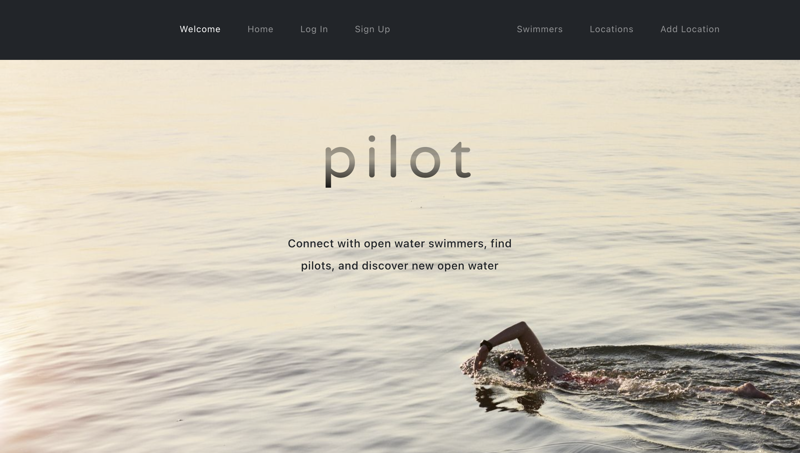

# Pilot

"Pilot" is React App that encourages users to connnect with open water swimmers, find pilots, and discover new open water.

This is the front end of a decoupled MERN Stack app that includes JWT Authentication.
You can find the back end code [here](https://github.com/ndrewgallup/pilot-back-end).

This app was conceptualized, designed, and coded by [Vanessa Konynenbelt](https://github.com/vanessa-konynenbelt), [Andrew Gallop](https://github.com/ndrewgallup), and [Claire Carden](https://github.com/smclairecarden).

## Getting Started

**Check out the deployed application [here](https://vac-pilot.herokuapp.com/)**

This app was planned using Trello. You can check out our user stories, ERD, and wireframe [here](https://trello.com/b/0kOV1lFs/pilot).

## Technologies Used

## Next Steps

ICEBOX STUFF